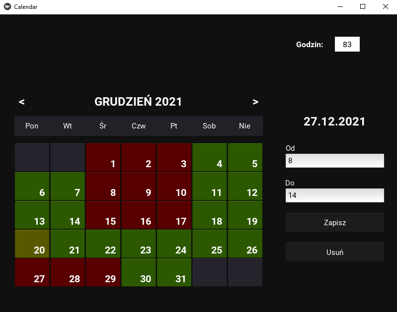

# Kalendarz do planowania pracy

NArzędzie wykonane, aby pomóc mi zorientować się w miesięcznym rozkładzie mojej pracy, który jest dosyć elastyczny i niestandardowy. Z racji wymagań projektu na uczelnię, byłem ograniczony do Pythona i biblioteki graficznej - żadnych zewnętrznych źródeł, API, itp.

README po angielsku: [LINK](README.md)

## Funkcjonalności

- licznik godzin w miesiącu
- customowy klikalny widget kalendarza
- interfejs obsługiwalny tabulatorami
- przechowywanie danych w plikach txt

## Użyte technologie

- Python 3.9.7
- Kivy

## Wygląd interfejsu
